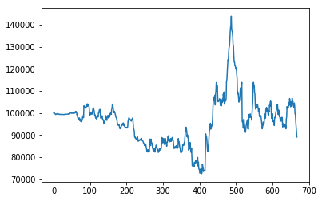
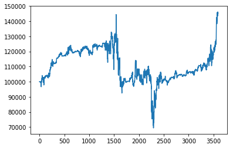
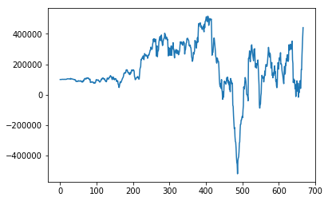
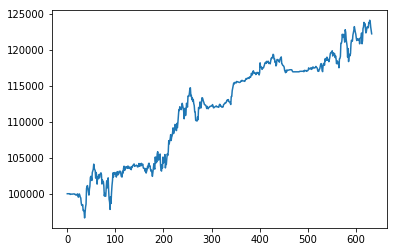
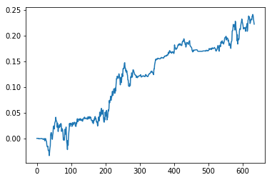

# reinforcement-learning-for-algorithm-trading

After getting the cointegrated stocks, I seclect one of combinations: STI and HBAN. Besides the two of them, I also add S&P500, DOW30 , market volatilty(VIX) as alpha factors or indicators.

Simularing the mean reverting strategy. At first, I assume $100,000 cash and buy or sell 100 amount of stock if needed. Reward is the change of the portfolio in every turn.

Try 4 different reinforcement learning algorithm: Actor-Critic, A3C, PPO, and evolution based reinforcement learning.

Evolution works best. Even though at first, it works worse, after mutate, combinatin with better ones, we can see that the kids one wokrs better than father one. Every generation is 20 kids and choose the better 10 as father to evolve next generation. (The algorithm is parallelism or multiprocessing

As you can see, after 15 episode, the annual return can reach 28%

Actor-Critic, A3C, PPO are similar algorithm. Even though they may work better at first. Due to lo low learning rate. It is hard to step large. Therefore, the rturn of portfolio cannot converge. It bounce back and forward.(following are the portfolio value during one episode)

The ppo I used is clipping one, or PPO2. 

I also simulate a scenario for buying one stock and test it from 2017 to 2019 and it outperforms S&P500, DOW30, and the stock itself.

Here is the return

